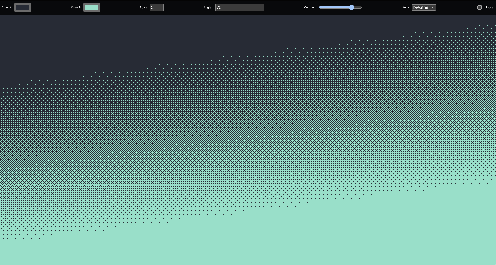

# 🎨 Dither Study



A small interactive playground for exploring **ordered dithering** with the classic Bayer matrix.  
Built with **HTML, CSS, and vanilla JavaScript** — no frameworks required.

---

## ✨ Features

- **Two-color dithering**: pick your own foreground/background colors.
- **Adjustable scale**: control the pixel block size for that chunky 8-bit look.
- **Gradient angle & contrast**: rotate the gradient and exaggerate or soften transitions.
- **Animation modes**:
  - `off` → static dither pattern
  - `shimmer` → slides the Bayer mask (retro CRT shimmer)
  - `breathe` → subtle pulsing of gradient angle & contrast
  - `flicker` → micro-jitter in thresholds for a TV static vibe
- **Pause checkbox**: freeze the animation at any time.

---

## 🖼️ What is Bayer Dithering?

The app uses an **8×8 Bayer matrix** as a threshold map. Each pixel’s brightness is compared against the matrix at that position:

```bash
00 32 08 40 02 34 10 42
48 16 56 24 50 18 58 26
12 44 04 36 14 46 06 38
60 28 52 20 62 30 54 22
03 35 11 43 01 33 09 41
51 19 59 27 49 17 57 25
15 47 07 39 13 45 05 37
63 31 55 23 61 29 53 21
```

As intensity rises, thresholds are crossed in this order, giving smooth gradients from just two colors.

Here is a codepen demo that I made that illustrates the basic concept:  

[https://codepen.io/ryanzola/pen/vENqRxx](https://codepen.io/ryanzola/pen/vENqRxx)

---

## 🚀 Getting Started

Clone the repo and run a dev server (for example, with [Vite](https://vitejs.dev)):

```bash
git clone https://github.com/yourname/dither-study.git
cd dither-study
npm install
npx vite
```

Then open <http://localhost:5173> in your browser.

🕹️ Usage

- Use the color pickers to choose Color A and Color B.
- Adjust Scale to change pixel block size.
- Adjust Angle and Contrast for different gradient effects.
- Select an Anim mode to see different dynamic behaviors.
- Tick Pause to freeze the canvas.
